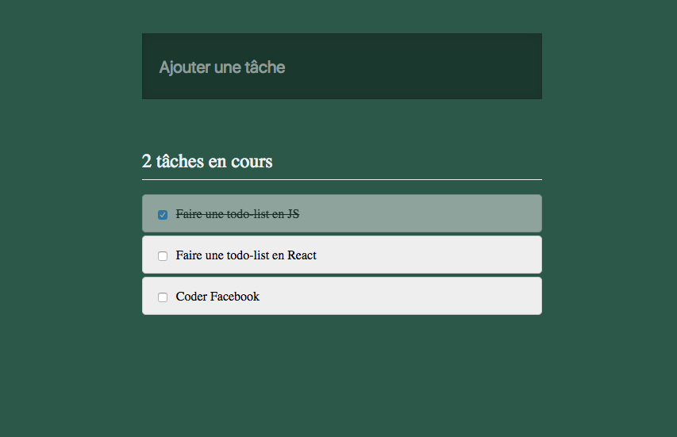

# To-do list

Créons une to-do list simple avec JavaScript :smiley:

## Resultat Attendu

1. L'interface doit être construite en JS

2. On doit pouvoir ajouter une tâche en écrivant dans l'input puis
en validant avec la touche `Entrée`.  
On peut écouter le submit plutôt que le clavier, plus simple…

3. On peut cocher une tâche pour la marquer comme effectuée.

4. Un compteur recense les tâches non effectuées.

## Instructions

Pas d'instructions :scream:

On est en spé maintenant, va falloir essayer de trouver tout seul ce qu'il
faut créer pour réaliser l'exercice. Organisez-vous comme vous voulez, du
moment que l'application correspond au résultat attendu.

Si vous réussissez à faire 1 et 2, c'est déjà super !  
Pour les points 3 et 4, c'est un peu plus coton :cloud:

Pas d'instructions, mais quelques contraintes cependant :
* On n'a pas le droit de toucher au html ! Va falloir créer tous les éléments en js :yum:

* On ne touche pas au html… …donc on ne rajoute pas de jQuery :smiling_imp:  
Quand on utilise React, on utilisera rarement jQuery en même temps. Autant s'y habituer !

## Charte

* Fond = `#2e5849`
* Fond Input = `#1c382f`
* Bordure Input = `#183129`
* Ombre interne Input = `25px` `rgba(0,0,0,.1)`
* Ombre interne Input Focus = `25px` `rgba(0,0,0,.5)`
* Texte Input = `#fff`
* Placeholder Input = `rgba(255, 255, 255, .5)`
* Fond Tâche = `#eee`
* Bordure tâche = `#ccc`

## Help

* https://developer.mozilla.org/fr/docs/Web/API/Document/getElementById
* https://developer.mozilla.org/fr/docs/Web/API/EventTarget/addEventListener
* https://developer.mozilla.org/fr/docs/Web/API/Document/createElement
* https://developer.mozilla.org/fr/docs/Web/API/Node/textContent
* https://developer.mozilla.org/fr/docs/Web/API/Element/className
* https://developer.mozilla.org/fr/docs/Web/API/Element/classList
* https://developer.mozilla.org/fr/docs/Web/API/Node/appendChild
